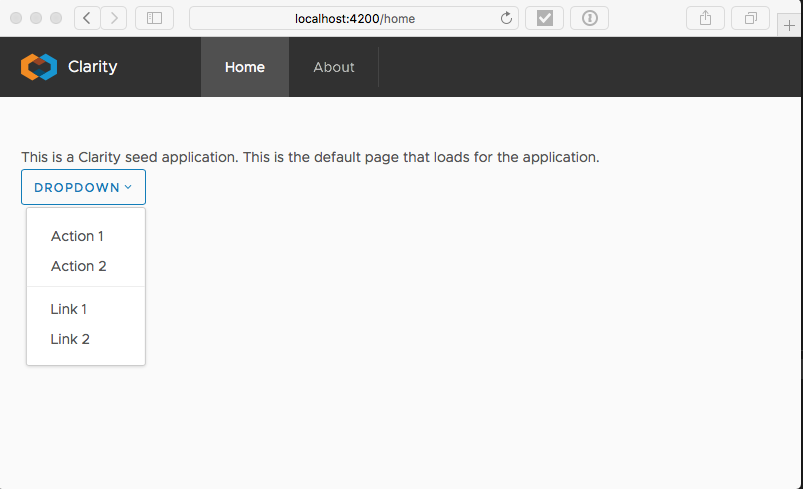
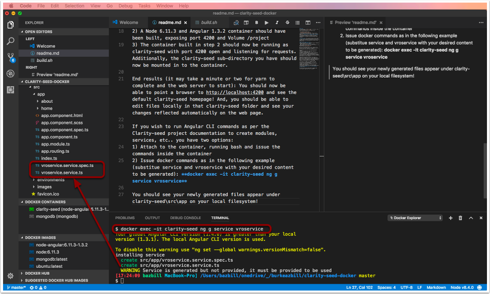

# Overview
This repository is an effort to make it even easier to get started with VMware's [Clarity seed](https://github.com/vmware/clarity-seed) project.

I've provided two options here:
- [Standalone Container Dockerfile](./Clarity-Seed-Container/Dockerfile): This is a fully encapsulated Clarity seed environment. To edit files you need to run **docker exec -it (container-name) /bin/bash** to gain access to the console. The Dockerfile has a few self-documenting comments at the bottom. This option requires Docker to already be installed and basic Docker knowledge.

- **Dev Instance**: This is what you see in the root folder: 3 files. This option provides you the ability to have all the Node/Angular running in a container but have the Clarity seed files in a clarity-seed subdirectory locally on your container host!

## Dev Instance Usage Instructions:
- Make sure you have **git** installed. If you're looking at this page, hopefully you already do!
- Make sure you also have **docker** installed
- Have an editor you are comfortable with. Personally, I've been happy with [Visual Studio Code](https://code.visualstudio.com/) 

Now that you have the prerequisites met, simply run the build.sh file! (OK Windows users, I provided the same file as build.cmd as well - but have not tested it!)

Once you have run the file, the following should have happened:
1) The clarity-seed project should have cloned to a sub-directory named clarity-seed
2) A Node 6.11.3, Angular 4.3.5 and Angular-CLI 1.3.2 container should have been built, exposing port 4200 and Volume /project
3) The container built in step 2 should now be running as clarity-seed with port 4200 open and listening for requests. Additionally, the clarity-seed sub-directory you have should now be mounted in to the container.

End results (it may take a minute or two for yarn to complete and the web server to start): You should now be able to point a browser to http://localhost:4200 and see the default clarity-seed homepage! And, you should be able to edit files locally in that clarity-seed folder and see your changes reflected automatically on the web page.

## Running Angular CLI commands
If you wish to run Angular CLI commands as per the Clarity-seed project documentation to create modules, services, etc.. you have two options:
1) Attach to the container, running bash and issue the commands inside the container
2) Issue docker commands as in the following example (substitue service and vroservice with your desired content to be generated): **docker exec -it clarity-seed ng g service vroservice**

You should see your newly generated files appear under clarity-seed\src\app on your local filesystem!

## SPECIAL THANKS
Thanks Timo for your assistance in getting the Dev version here figured out with me!